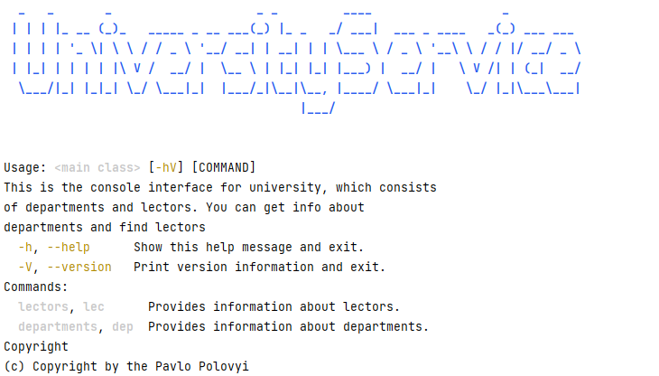

# UNIVERSITY SERVICE
 
<h2>📣 Project description 📣</h2>
This is a simple java project with the console interface for university, which consists of departments and lectors. It is built up using <a href="https://spring.io/projects/spring-boot">Spring Boot</a> and <a href="https://picocli.info/">Picoli CLI framework</a>. It uses an in-memory H2 database, but it can be replaced any time. Users can get such information about the university department: head of department, average salary, employees count and summary statistics about academic degree of employees. Moreover there is a global search of lectors with ANSI highlighting of found patterns.

<h2>Features</h2>

* Fully featured CLI for usage

* 3-layer architecture: CLI, Services and Repositories

* In-memory database H2

* Tests for repository custom queries and SpringBootApplication class

<h2>Technologies</h2>

* Java 17

* Spring Boot 3

* Picoli

* Spring Data JPA

* Hibernate

* Liquibase

* Lombok

* H2 database

* JUnit5, Testcontainers, Spring Boot Testing

## <h2>:bomb:Instructions for launching the project:bomb:</h2>

<h4>To run this project locally you need <a href="https://www.oracle.com/java/technologies/javase/jdk17-archive-downloads.html">JDK</a> installed, follow these steps:</h4>

1️⃣ Clone this project from GitHub:

```bash
https://github.com/PavloPolovyi/university-service
```

2️⃣  Navigate to project folder in terminal and run following command:

```bash
./mvnw clean package -DskipTests
```

3️⃣ Then you can test application. Notice, that database is prepopulated with mock data. Run following command to see help:

```bash
java -jar .\target\university-service-0.0.1-SNAPSHOT.jar --help 
```

You will see following response from the application:



